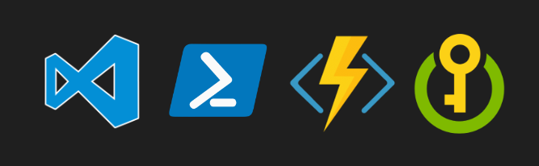
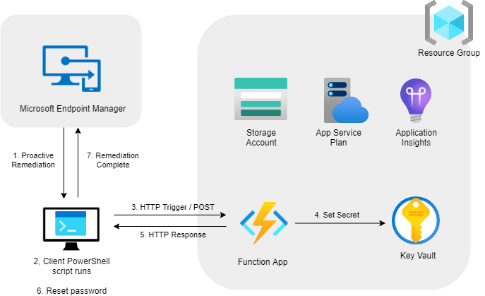

# Serverless LAPS

Automatically create and recycle unique local admin passwords using Azure Functions, Key Vault and Proactive Remediations.

Find more information at [markkerry.github.io - Serverless LAPS Azure Function and Proactive Remediation](https://markkerry.github.io/posts/2021/04/serverless-laps-azure-function/)

 

Based on the great solution created by [John Seerden](https://www.srdn.io/2018/09/serverless-laps-powered-by-microsoft-intune-azure-functions-and-azure-key-vault/). Other really nice Serverless LAPS blogs can be found below:

* https://1337.uk/articles/serverless-laps-with-terraform
* https://www.cloud-boy.be/blog/serverless-laps-with-intune-function-app-and-key-vault/

And creating and deploying Azure Functions by [Serverless on Azure](https://www.youtube.com/channel/UCmoWqg6T-c8zEGm4sZdnwbA) YouTube channel.

 

## My Slight Variation

In my guide I did the following:

* Create the Azure resources with Azure CLI
* Create and deploy the Azure Function using Azure Functions Core Tools
* Used a MEM Endpoint Analytics Proactive Remediation to manage the recycling of the admin password

My take on it (based on John Sneerden's solution) looks as follows:

